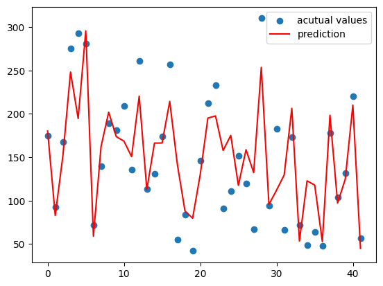
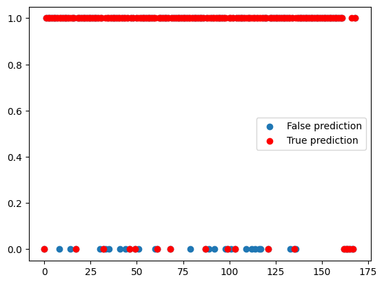
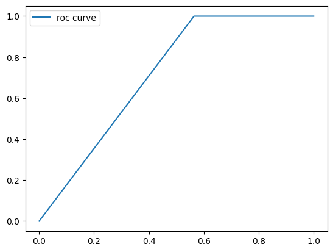
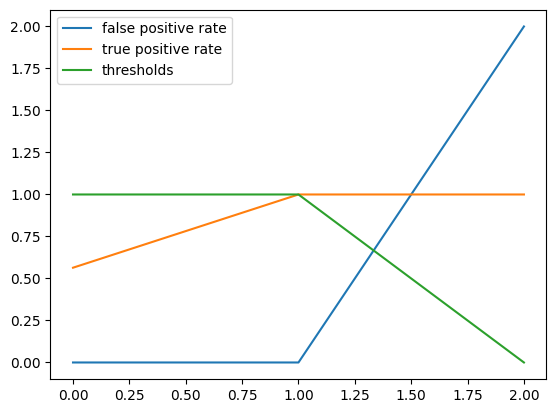

# Docs for srlearn

# _____________________________________________

## Imports


```python
# Linear models
from srlearn import LinearModels
# Pandas dataframe and series encoder
from srlearn.PreProcessing import pandas_encoder
# statistics for categorical data
from srlearn.rstats import entropy, gain
# Parsing tree for decision making
from srlearn.CategoricalModels import ParsingTree

# Other libraries to train, test and evaluate our models
import pandas as pd
import numpy as np
from sklearn import datasets
from sklearn.metrics import r2_score, confusion_matrix, accuracy_score, roc_curve
import matplotlib.pyplot as plt
```

# _____________________________________________

## Linear Regression


```python
# Loading dataset

d = datasets.load_diabetes()
x = d['data']
y = d['target']
```


```python
# Splitting dataset

x_train = x[:400]
y_train = y[:400]
x_test = x[400:]
y_test = y[400:]
```


```python
# Initializing linear regression model
model = LinearModels.LinearRegression()

# Fitting the model on our data
model.fit(x_train, y_train)

# Predicting test data with our trained model
y_pred = model.predict(x_test)
```


```python
# Visualizing the model predictions

plt.scatter([i for i in range(len(y_test))], y_test, label="acutual values")
plt.plot(y_pred, c='red', label="prediction")
plt.legend()
```


    <matplotlib.legend.Legend at 0x2dc565836d0>


    

    


```python
# r2 score of our trained model
r2_score(y_test, y_pred)
```


    0.7088916940378884


# _____________________________________________

## Logistic Regression


```python
# Loading dataset

d = datasets.load_breast_cancer()
x = d['data']
y = d['target']
```


```python
# Splitting dataset

x_train = x[:400]
y_train = y[:400]
x_test = x[400:]
y_test = y[400:]
```


```python
# Initializing linear regression model
model2 = LinearModels.LogisticRegression()

# Fitting the model on our data
model2.fit(x_train, y_train)

# Predicting test data with our trained model
y_pred = model2.predict(x_test)
```


```python
# Visualizing the model predictions

plt.scatter([i for i in range(len(y_test))], y_test, label="False prediction")
plt.scatter([i for i in range(len(y_test))], y_pred, c="red", label="True prediction")
plt.legend()
```


    <matplotlib.legend.Legend at 0x2dc565ee390>


    

    


```python
# Confusion metrics of model predictions
confusion_matrix(y_test, y_pred)
```


    array([[ 17,  22],
           [  0, 130]], dtype=int64)


```python
# accuracy score of model predictions

accuracy_score(y_test, y_pred)
```


    0.8698224852071006


```python
# ROC curve of our model

fpr, tpr, thresholds = roc_curve(y_test, y_pred)
plt.plot(fpr, tpr, label='roc curve')
plt.legend()
```


    <matplotlib.legend.Legend at 0x2dc566fe390>


    

    


```python
# ROC parameters of our model

plt.plot(roc_curve(y_test, y_pred), label=["false positive rate", "true positive rate", "thresholds"])
plt.legend()
```


    <matplotlib.legend.Legend at 0x2dc56763f50>


    

    


# _____________________________________________

## Encoder for Pandas


```python
# Creating a dummy classification data

df = pd.DataFrame(
    {
        'outlook': [
            "Sunny", "Sunny", "Overcast", "Rain", "Rain", "Rain", "Overcast", "Sunny", "Sunny", "Rain", "Sunny",
            "Overcast", "Overcast", "Rain"
            ],
        'temp': [
            "Hot", "Hot", "Hot", "Mild", "Cool", "Cool", "Cool", "Mild", "Cool", "Mild", "Mild", "Mild", "Hot", "Mild"
            ],
        'humidity': [
            "High", "High", "High", "High", "Normal", "Normal", "Normal", "High", "Normal", "Normal", "Normal",
            "High", "Normal", "High"
            ],
        'wind': [
            "Weak", "Strong", "Weak", "Weak", "Weak", "Strong", "Weak", "Weak", "Weak", "Strong", "Strong", "Strong",
            "Weak", "Strong"
            ],
        'play': ["No", "No", "Yes", "Yes", "Yes", "No", "Yes", "No", "Yes", "Yes", "Yes", "Yes", "Yes", "No"]
    },
    index=[i for i in range(14)]
)

df
```


<div>
<style scoped>
    .dataframe tbody tr th:only-of-type {
        vertical-align: middle;
    }

    .dataframe tbody tr th {
        vertical-align: top;
    }

    .dataframe thead th {
        text-align: right;
    }
</style>
<table border="1" class="dataframe">
  <thead>
    <tr style="text-align: right;">
      <th></th>
      <th>outlook</th>
      <th>temp</th>
      <th>humidity</th>
      <th>wind</th>
      <th>play</th>
    </tr>
  </thead>
  <tbody>
    <tr>
      <th>0</th>
      <td>Sunny</td>
      <td>Hot</td>
      <td>High</td>
      <td>Weak</td>
      <td>No</td>
    </tr>
    <tr>
      <th>1</th>
      <td>Sunny</td>
      <td>Hot</td>
      <td>High</td>
      <td>Strong</td>
      <td>No</td>
    </tr>
    <tr>
      <th>2</th>
      <td>Overcast</td>
      <td>Hot</td>
      <td>High</td>
      <td>Weak</td>
      <td>Yes</td>
    </tr>
    <tr>
      <th>3</th>
      <td>Rain</td>
      <td>Mild</td>
      <td>High</td>
      <td>Weak</td>
      <td>Yes</td>
    </tr>
    <tr>
      <th>4</th>
      <td>Rain</td>
      <td>Cool</td>
      <td>Normal</td>
      <td>Weak</td>
      <td>Yes</td>
    </tr>
    <tr>
      <th>5</th>
      <td>Rain</td>
      <td>Cool</td>
      <td>Normal</td>
      <td>Strong</td>
      <td>No</td>
    </tr>
    <tr>
      <th>6</th>
      <td>Overcast</td>
      <td>Cool</td>
      <td>Normal</td>
      <td>Weak</td>
      <td>Yes</td>
    </tr>
    <tr>
      <th>7</th>
      <td>Sunny</td>
      <td>Mild</td>
      <td>High</td>
      <td>Weak</td>
      <td>No</td>
    </tr>
    <tr>
      <th>8</th>
      <td>Sunny</td>
      <td>Cool</td>
      <td>Normal</td>
      <td>Weak</td>
      <td>Yes</td>
    </tr>
    <tr>
      <th>9</th>
      <td>Rain</td>
      <td>Mild</td>
      <td>Normal</td>
      <td>Strong</td>
      <td>Yes</td>
    </tr>
    <tr>
      <th>10</th>
      <td>Sunny</td>
      <td>Mild</td>
      <td>Normal</td>
      <td>Strong</td>
      <td>Yes</td>
    </tr>
    <tr>
      <th>11</th>
      <td>Overcast</td>
      <td>Mild</td>
      <td>High</td>
      <td>Strong</td>
      <td>Yes</td>
    </tr>
    <tr>
      <th>12</th>
      <td>Overcast</td>
      <td>Hot</td>
      <td>Normal</td>
      <td>Weak</td>
      <td>Yes</td>
    </tr>
    <tr>
      <th>13</th>
      <td>Rain</td>
      <td>Mild</td>
      <td>High</td>
      <td>Strong</td>
      <td>No</td>
    </tr>
  </tbody>
</table>
</div>


```python
# Loading the pandas encoder class and encoding the dataframe
enc = pandas_encoder()
enc.fit(df)
encoded_df = enc.encode()

encoded_df
```


<div>
<style scoped>
    .dataframe tbody tr th:only-of-type {
        vertical-align: middle;
    }

    .dataframe tbody tr th {
        vertical-align: top;
    }

    .dataframe thead th {
        text-align: right;
    }
</style>
<table border="1" class="dataframe">
  <thead>
    <tr style="text-align: right;">
      <th></th>
      <th>outlook</th>
      <th>temp</th>
      <th>humidity</th>
      <th>wind</th>
      <th>play</th>
    </tr>
  </thead>
  <tbody>
    <tr>
      <th>0</th>
      <td>0</td>
      <td>0</td>
      <td>0</td>
      <td>0</td>
      <td>0</td>
    </tr>
    <tr>
      <th>1</th>
      <td>0</td>
      <td>0</td>
      <td>0</td>
      <td>1</td>
      <td>0</td>
    </tr>
    <tr>
      <th>2</th>
      <td>1</td>
      <td>0</td>
      <td>0</td>
      <td>0</td>
      <td>1</td>
    </tr>
    <tr>
      <th>3</th>
      <td>2</td>
      <td>1</td>
      <td>0</td>
      <td>0</td>
      <td>1</td>
    </tr>
    <tr>
      <th>4</th>
      <td>2</td>
      <td>2</td>
      <td>1</td>
      <td>0</td>
      <td>1</td>
    </tr>
    <tr>
      <th>5</th>
      <td>2</td>
      <td>2</td>
      <td>1</td>
      <td>1</td>
      <td>0</td>
    </tr>
    <tr>
      <th>6</th>
      <td>1</td>
      <td>2</td>
      <td>1</td>
      <td>0</td>
      <td>1</td>
    </tr>
    <tr>
      <th>7</th>
      <td>0</td>
      <td>1</td>
      <td>0</td>
      <td>0</td>
      <td>0</td>
    </tr>
    <tr>
      <th>8</th>
      <td>0</td>
      <td>2</td>
      <td>1</td>
      <td>0</td>
      <td>1</td>
    </tr>
    <tr>
      <th>9</th>
      <td>2</td>
      <td>1</td>
      <td>1</td>
      <td>1</td>
      <td>1</td>
    </tr>
    <tr>
      <th>10</th>
      <td>0</td>
      <td>1</td>
      <td>1</td>
      <td>1</td>
      <td>1</td>
    </tr>
    <tr>
      <th>11</th>
      <td>1</td>
      <td>1</td>
      <td>0</td>
      <td>1</td>
      <td>1</td>
    </tr>
    <tr>
      <th>12</th>
      <td>1</td>
      <td>0</td>
      <td>1</td>
      <td>0</td>
      <td>1</td>
    </tr>
    <tr>
      <th>13</th>
      <td>2</td>
      <td>1</td>
      <td>0</td>
      <td>1</td>
      <td>0</td>
    </tr>
  </tbody>
</table>
</div>


```python
# Decoding a dataframe related to our previous dataframe
x_test = np.array([[2, 2, 0, 1], [0, 2, 1, 1], [0, 0, 1, 1]])
test_df = pd.DataFrame(x_test, columns=['outlook', 'temp', 'humidity', 'wind'])

enc.decode(test_df)
```


<div>
<style scoped>
    .dataframe tbody tr th:only-of-type {
        vertical-align: middle;
    }

    .dataframe tbody tr th {
        vertical-align: top;
    }

    .dataframe thead th {
        text-align: right;
    }
</style>
<table border="1" class="dataframe">
  <thead>
    <tr style="text-align: right;">
      <th></th>
      <th>outlook</th>
      <th>temp</th>
      <th>humidity</th>
      <th>wind</th>
    </tr>
  </thead>
  <tbody>
    <tr>
      <th>0</th>
      <td>Rain</td>
      <td>Cool</td>
      <td>High</td>
      <td>Strong</td>
    </tr>
    <tr>
      <th>1</th>
      <td>Sunny</td>
      <td>Cool</td>
      <td>Normal</td>
      <td>Strong</td>
    </tr>
    <tr>
      <th>2</th>
      <td>Sunny</td>
      <td>Hot</td>
      <td>Normal</td>
      <td>Strong</td>
    </tr>
  </tbody>
</table>
</div>


# _____________________________________________

## Statistics for categorical data


```python
# Lets take the encoded dataframe from our pandas_encoder class to calculate entropy and gain

# Entropy in our outcome column
entropy(encoded_df['play'].to_numpy())
```


    0.9402859586706311


```python
# Gain of feature columns for the outcome column
for c in encoded_df.columns.to_list():
    g = gain(encoded_df[c].to_numpy(), encoded_df['play'].to_numpy())
    print(f"Gain for feature {c} is: {g}")
    print()
```

    Gain for feature outlook is: 0.24674981977443933
    
    Gain for feature temp is: 0.02922256565895487
    
    Gain for feature humidity is: 0.15183550136234164
    
    Gain for feature wind is: 0.048127030408269544
    
    Gain for feature play is: 0.9402859586706311
    
    

# _____________________________________________

## Parsing tree model for categorical classification


```python
# Again lets take encoded data from pandas encoder

x = encoded_df.to_numpy()[:,:4]
y = encoded_df.to_numpy()[:,4]
```


```python
# Initializing parsing tree class and fitting the data in it
tree = ParsingTree()
tree.fit(x, y)
```


```python
# predicting the testing data we created in our pandas encoder class test
test_df['play'] = tree.predict(x_test)

# printing the predictions
enc.decode(test_df)
```


<div>
<style scoped>
    .dataframe tbody tr th:only-of-type {
        vertical-align: middle;
    }

    .dataframe tbody tr th {
        vertical-align: top;
    }

    .dataframe thead th {
        text-align: right;
    }
</style>
<table border="1" class="dataframe">
  <thead>
    <tr style="text-align: right;">
      <th></th>
      <th>outlook</th>
      <th>temp</th>
      <th>humidity</th>
      <th>wind</th>
      <th>play</th>
    </tr>
  </thead>
  <tbody>
    <tr>
      <th>0</th>
      <td>Rain</td>
      <td>Cool</td>
      <td>High</td>
      <td>Strong</td>
      <td>No</td>
    </tr>
    <tr>
      <th>1</th>
      <td>Sunny</td>
      <td>Cool</td>
      <td>Normal</td>
      <td>Strong</td>
      <td>Yes</td>
    </tr>
    <tr>
      <th>2</th>
      <td>Sunny</td>
      <td>Hot</td>
      <td>Normal</td>
      <td>Strong</td>
      <td>No</td>
    </tr>
  </tbody>
</table>
</div>


# _____________________________________________


```python

```
